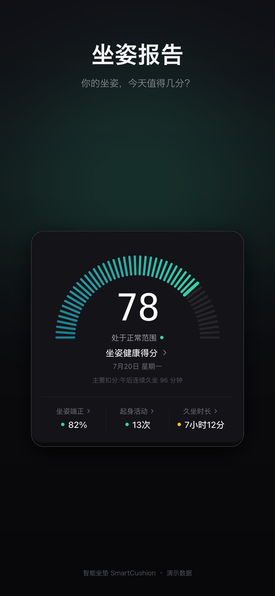

# 有垫东西

面向久坐人群的智能坐垫健康系统：坐垫和毫米波雷达采集坐姿、心率与呼吸趋势，
iPhone 在本地生成日报；连续久坐时，系统还可以触发 Galaxea A1Z 机械臂做
非接触式提醒。

这是 AdventureX 黑客松的开源提交仓库，包含 iOS App、MQTT 数据协议、提醒服务、
G0.5 VLA 到 A1Z 的安全执行桥、仿真与演示材料。



> 本项目提供健康趋势参考，不属于医疗诊断设备。机器人演示仍是实验性功能；
> 在运行任何真机命令前，请先阅读
> [A1Z 强制安全规则](hardware/robot-arm/README.md#mandatory-a1z-safety)。

## 为什么做

普通久坐提醒只知道“时间到了”。有垫东西把提醒拆成三个可验证的环节：

1. **感知**：五路 FSR 判断坐姿，毫米波雷达提供心率、呼吸率和距离趋势。
2. **理解**：iPhone 将真实片段整理为日报、趋势与恢复状态，健康数据留在设备端。
3. **行动**：连续久坐事件经 MQTT 进入提醒服务，由 G0.5 生成动作，并通过安全
   daemon 映射到 A1Z；人的提醒始终使用非接触动作。

## 系统架构

```text
FSR × 5 / mmWave radar
          │ MQTT
          ▼
     MQTT Broker ───────────────► iPhone App
          │                       日报 / 趋势 / Apple Health
          ▼
Cushion Reminder Service
          │ RobotIntent
          ▼
DGX Spark: G0.5 policy ──WebSocket──► Mark/WSL safety daemon ──CAN──► A1Z
```

详细的数据边界、运行节点和安全门禁见
[系统架构说明](docs/ARCHITECTURE.md)。

## 当前完成度

| 模块 | 状态 | 入口 |
| --- | --- | --- |
| iPhone 日报与趋势 | 可运行，真实数据为空时显示空状态 | [`src/`](src/) |
| Apple Health | 只读同步；SQLCipher 本地镜像 | [构建手册](docs/BUILD_AND_RELEASE.md) |
| 坐垫 MQTT | App 与服务均已接入 | [协议](docs/MQTT_PROTOCOL.md) |
| 本地提醒服务 | 模拟器、API、Web 控制台可运行 | [服务说明](hardware/robot-arm/cushion-reminder-service/README.md) |
| G0.5 → A1Z | 已完成真机链路；语义抓取仍属实验 | [部署手册](hardware/robot-arm/a1z-g05-client/README.md) |
| 安全执行 | 50 Hz daemon、频率下限、watchdog、关节限位 | [技术总结](hardware/robot-arm/docs/g05-a1z-technical-summary.md) |
| 固件 | 当前仓库公开协议与接入边界，板端源码仍待整理 | [固件范围](hardware/robot-arm/firmware/README.md) |

## 快速开始

### 1. 运行 iPhone / Web App

要求 Node.js 22.13 或更高版本。

```bash
npm ci
npm run web
```

网页预览不提供 HealthKit。验证 Apple Health、SQLCipher 和本地通知时，需要 iPhone
development build：

```bash
npm run start:dev-client
```

### 2. 在没有硬件时运行 MQTT 模拟器

要求 Python 3.10+ 和 [`uv`](https://docs.astral.sh/uv/)。

终端 A：

```bash
cd hardware/robot-arm/cushion-reminder-service
bash scripts/start-local-simulator.sh --loop
```

终端 B：

```bash
cd hardware/robot-arm/cushion-reminder-service
uv run --extra dev cushion-web
```

打开 `http://127.0.0.1:3000`。默认是 shadow mode，不会连接 DGX，也不会移动机械臂。

### 3. 运行检查

```bash
# App
npm run typecheck
npm run lint

# MQTT / 提醒服务
cd hardware/robot-arm/cushion-reminder-service
uv run --extra dev pytest -q
uv run --extra dev ruff check src tests
```

真机 A1Z 环境、DGX checkpoint 和摄像头配置请严格按照
[硬件部署手册](hardware/robot-arm/a1z-g05-client/README.md)操作，不要从快速开始
直接跳到执行模式。

## 仓库结构

```text
.
├── src/                         # Expo / React Native iPhone App
├── assets/                      # App 图标和静态资源
├── plugins/                     # Expo 配置插件
├── docs/                        # 架构、协议、构建和展会验收
└── hardware/
    └── robot-arm/
        ├── cushion-reminder-service/  # MQTT → RobotIntent 服务
        ├── a1z-g05-client/            # DGX G0.5 ↔ A1Z 桥与安全 daemon
        ├── scripts/ + tests/          # 受保护的硬件脚本与回归测试
        ├── simulation/                # FK / IK / MuJoCo 离线工具
        ├── frontend/cushion-dashboard # 早期 Web 报告原型
        ├── recordings/                # 示例 teach-and-play 轨迹
        └── docs/                      # 真机 runbook 与技术记录
```

`src/` 是当前产品 App；`hardware/robot-arm/frontend/cushion-dashboard/` 是黑客松早期
Web 视觉原型，保留用于展示设计演进，不是第二个生产前端。

## 文档导航

- [文档索引](docs/README.md)
- [系统架构](docs/ARCHITECTURE.md)
- [MQTT 协议](docs/MQTT_PROTOCOL.md)
- [实时数据领域规范](docs/CUSHION_REALTIME_DATA_SPEC.md)
- [展会验收清单](docs/EXHIBITION_ACCEPTANCE_TEST.md)
- [A1Z 黑客松演示流程](hardware/robot-arm/docs/smart-cushion-a1z-hackathon-demo.md)
- [贡献指南](CONTRIBUTING.md)

## 隐私与安全

- HealthKit 只读；应用不写入或修改 Apple Health。
- 健康样本镜像使用 SQLCipher，加密密钥保存在 iOS 钥匙串。
- 原始 BPM、呼吸率和 ADC 只保留在短时内存窗口，不进入常规日志。
- 未经校准的压力值不会被包装成力值或医疗结论。
- A1Z 没有刹车锁，失去扭矩会下落；真机测试必须有人值守并清空工作区。
- 当前 RGB-only VLA 没有力/触觉安全合同，不允许触碰、戳碰或击打真人。

## 开源许可

项目自有代码使用 [MIT License](LICENSE)。`hardware/` 中保留了原硬件仓库的
MIT 许可与版权声明；第三方依赖和上游模型继续遵循各自许可证。
